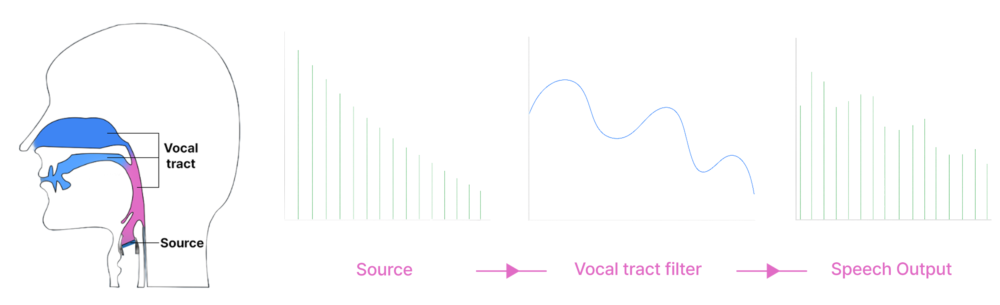
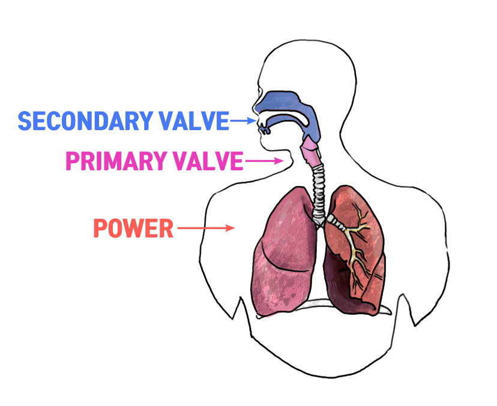
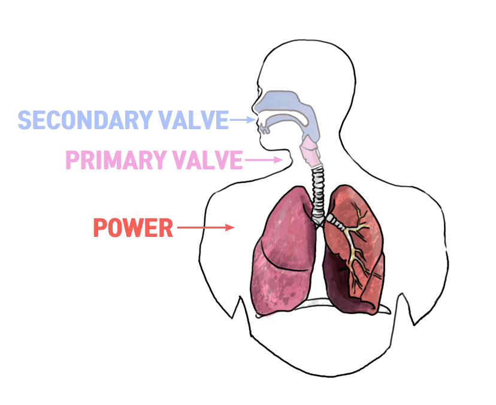
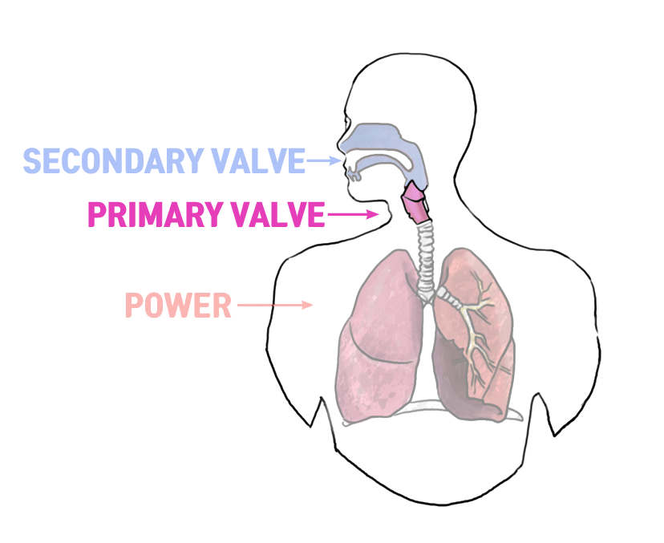
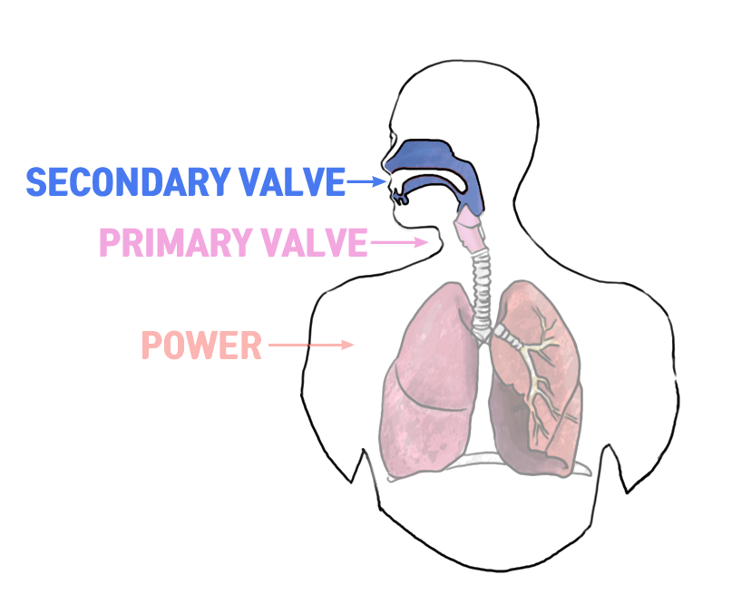

## 1-1. 왜 진단이 필요한가요?

노래 연습을 하다 보면 이런 생각이 들 때가 있습니다.  

“왜 나는 고음이 잘 안 될까?”  
“왜 연습할수록 더 불편하지?”  
“왜 이 연습은 나한테는 효과가 없을까?”  

이럴 때 많은 분들이  
“연습이 부족한 걸까?”, 
“혹시 나한테는 소질이 없는 건 아닐까?” 하고  
막연한 고민에 빠지게 됩니다.  

저 역시 그랬습니다.  
여러 연습을 시도하고, 공부하고, 코치로서 많은 레슨을 해오면서  
단순히 좋은 연습법을 찾는 것보다 더 중요한 것은  
**“왜 이 연습이 필요한지를 이해하고 선택하는 것”**이라는 것입니다.  

물론 발성은 ‘정답’이 정해진 영역은 아닙니다.  
하지만 각자의 발성 방식에는 분명한 ‘경향’이 존재하고,  
그 경향을 정확히 파악하는 것이  
연습 방향을 설정하는 데 있어 가장 중요한 시작이 됩니다.  

그렇다면,  
보이스큐어는 이 ‘경향’을 어떻게 진단할 수 있을까요?  

다음 챕터에서는  
그 진단이 어떤 개념들을 바탕으로 이루어지는지 함께 살펴보겠습니다.  

---

## 1-2. 진단에 사용되는 개념들

인강을 통해 발성을 배우는 경우,  
코치가 곁에서 직접 피드백을 줄 수 없기 때문에  
무엇보다 중요한 것은  
"지금 내가 어떤 방식으로 소리를 내고 있는지"를 스스로 인식하는 능력입니다.  

그래서 보이스큐어의 진단은 단순히  
“소리가 무겁습니다.”, “목이 조입니다.”처럼  
결과만을 평가하는 방식이 아닙니다.  

들리는 소리의 결과보다,  
그 소리를 만들기까지의 '조절 방식'을 우선적으로 살펴보고,  
그 안에 반복되는 경향을 파악함으로써,  
훈련의 방향을 설정합니다.  

---

### Source–Filter Theory (기초 개념)

  

소리는 성대에서 만들어진 '원초적인 소리(Source)'가  
입과 혀, 인후 같은 통로(성도)를 거치며 '변형(Filter)'되어 최종적으로 들립니다.

이 모델은 음성학의 기초 개념으로,  
소리가 만들어지는 기본 구조를 설명할 때 유용합니다.  

하지만 실전 보컬 트레이닝에서는  
이 구조를 그대로 적용하기엔 한계가 있습니다.  

→ 어떤 조절이 필요한지, 훈련 방향을 어떻게 잡을지 판단하기엔 정보가 부족하기 때문입니다.  

---

### Power–Source–Valve Model (보이스큐어 진단의 핵심 프레임)

  

그래서 보이스큐어는  
**Power (호흡)** – **Valve 1 (성대)** – **Valve (성도)**  
세 가지 조절 기능을 기준으로 발성 경향을 진단합니다.  

- **Power (호흡)**: 숨을 얼마나, 어떻게 쓰는가  
- **Valve 1 (성대)**: 성대를 어떻게 닫고 여는가 그리고 얼마나 늘이고 줄이는가
- **Valve 2 (성도)**: 입과 인후를 어떻게 활용해 발음을 조절하는가  

각 기능은 서로 영향을 주고받기 때문에  
어느 하나만 독립적으로 조절하는 것이 아니라   
전체 흐름 속에서 어떤 조절에 더 의존하고 있는지를 파악하고  
그 경향에 맞춰 훈련 방향을 설정합니다.  

그래서 보이스큐어의 진단은 이 세 가지 기능 중  
어떤 영역의 조절이 강하게 나타나는지,  
어디에 보상 작용이 일어나고 있는지를 분석하는 데 중점을 둡니다.  

예를 들어,

- 호흡 조절이 부족할 경우, 이를 보상하기 위해 성대나 성도에 불필요한 긴장이 개입되는 경향
- 성대 조절이 부족할 경우, 호흡을 밀거나 성도를 과도하게 좁혀서 보상하려는 경향 
- 성도 조절이 부족할 경우, 성대를 과도하게 조여서 음색을 유지하려는 경향  

이러한 기능 간의 상호작용을 기반으로  
훈련의 시작점을 설정하고,  
기능별로 구분된 워크플로우를 따라 학습자가 점진적으로  
조절 능력을 키울 수 있도록 돕는 것이  
보이스큐어의 진단 체계입니다.  

---

  

#### Power – 호흡 조절 기능

발성에 필요한 **공기의 흐름(양과 압력)**을 조절하는 기능입니다.  
호흡이 약하면 소리가 떨리거나 조이는 느낌이 생기고,  
반대로 너무 세면 성대가 밀려 열리거나, 불필요한 긴장이 생기기 쉽습니다.  

그래서 문제에 맞는 호흡 흐름을 조절하고,  
지금의 나에게 맞는 발성 밸런스를 유지하는 것이 중요합니다.  

---

  

#### Source – 성대 조절 기능

성대를 닫고 여는 조절뿐 아니라, 길게 늘이거나 짧게 줄이는 조절도 포함됩니다.  
성대가 너무 강하게 닫히면 소리가 무거워지거나 조이는 느낌이 생기고,  
반대로 조절 없이 벌어지면 소리가 약하거나 불안정해질 수 있습니다.  

그래서 음역과 소리의 세기에 따라  
성대를 잘 닫고, 잘 늘이고, 잘 줄이는 조절 능력이 필요합니다.  

---

  

#### Valve – 성도 조절 기능

성도(입, 인두, 혀 등)는 단순히 음색을 바꾸는 통로가 아니라,  
성대의 움직임에 직접적으로 영향을 주는 조절 요소입니다.  
그래서 소리의 밝기나 어두움, 명료도, 발음 방식 등을 조절하면서  
호흡과 성대의 움직임과 함께 유기적으로 협응해야 합니다.  

> 
> “세 가지가 하나가 될 때, 발성은 자유로워집니다.”
> 

  

**이 세 가지 기능은 나누어 설명했지만,  
실제 발성에서는 항상 동시에 작동하며 서로 영향을 주고받습니다.  
그래서 연습할 때는 모든 조절을 의식적으로 통제하려 하기보다,  
지금 내가 어떤 기능에 지나치게 의존하고 있는지를 인식하고,  
그 기능을 중심으로 필요한 조절부터 연습한 뒤,   
점차 통합해 나가는 과정이 중요합니다.**  

---

## 2-1. 워크플로우란?

보이스큐어의 워크플로우는 단순한 연습 순서가 아니라,  
학습자의 발성 경향과 문제점을 기준으로  
"호흡, 성대, 성도"라는 세 가지 기능에 각각 포커스를 두고  
조절 능력을 점진적으로 키워가는 기능별 훈련 로드맵입니다.

각 단계는 개별 기능 중심으로 구성되어 있지만,  
모든 발성은 이 기능들이 동시에 작용하기 때문에  
결국에는 유기적이고 통합된 발성으로 이어지도록 설계되어 있습니다.

---

## 2-2. 왜 기능별로 나누어 연습하나요?

자동차처럼 복잡한 기계 시스템에서 문제를 해결할 때,  
전체를 통째로 교체하기보다 기능별 모듈을 점검하고 조정하듯  
발성 훈련도 마찬가지입니다.

발성 기관은 자동차의 하드웨어와 같고,  
그 움직임을 설계하고 조율하는 소프트웨어가 바로  
"호흡, 성대, 성도"를 나누어 훈련하는 기능별 접근입니다.

물론 실제 발성에서는 이 세 가지 기능이  
항상 동시에 작용하며 서로 영향을 주고받습니다.  
하지만 특정 기능에 주의를 집중해 조절력을 높이는 과정은,  
무의식적으로 굳어진 보상 패턴에서 벗어나  
더 균형 잡힌 자동화된 발성으로 이어지도록 돕습니다.

이처럼 기능을 구분해 훈련하는 방식은  
단순한 분리 연습이 아니라,  
전체 발성 시스템을 더 효율적으로 통합하기 위한 과정입니다.  

---

## 2-3. 연습할 때 ‘어디에 집중해야 할까요?’ – 감각의 초점(Focus of Attention)

발성 연습은 때로 "기능을 어떻게 조절할 것인가"에만 몰입하게 만듭니다.  
하지만 너무 내부적인 감각에만 머무르면 오히려 발성 능력이 떨어지기도 합니다.  
그래서 때론 ‘소리(밝기, 명료도, 세기, 연결)’라는 외부 결과에도 주의를 돌릴 필요가 있습니다.

중요한 것은, 어느 한쪽에만 치우치지 않고  
신체적인 감각에 집중할지, 외부적인 소리에 주목할지를 적절히 조절하며 연습하는 것입니다.

---

## 2-4. 워크플로우는 고정된 순서가 아닙니다

보이스큐어의 워크플로우는  
단순히 순서대로 따라가기만 하는 정해진 루트가 아닙니다.  
상황에 따라 연습 순서를 바꾸거나, 
자신에게 맞는 단계를 선택해 반복하는 것도 충분히 가능합니다.  

예를 들어 어떤 단계에서 막힘을 느낀다면,  
그 단계만 고집하기보다 다른 스텝이나 연습에서 단서를 찾는 것이  
오히려 문제 해결에 더 효과적일 수 있습니다.  
이는 발성이 호흡, 성대, 성도가 항상 함께 작용하는 통합적인 과정이기 때문입니다.  

또한 사람마다 신체 구조와 감각(하드웨어),  
그리고 조절 습관과 인식 방식(소프트웨어)이 다르기 때문에  
같은 훈련이라도 느껴지는 방식이나 효과가 다를 수 있습니다.  

그래서 보이스큐어의 워크플로우는  
정해진 순서를 그대로 따르기 위한 틀이 아니라,  
전체 흐름을 이해한 상태에서 "지금 나에게 필요한 연습"을 선택하고,  
필요하다면 건너뛰거나 되돌아가며 조절할 수 있도록 설계된 유연한 학습 도구입니다.  

