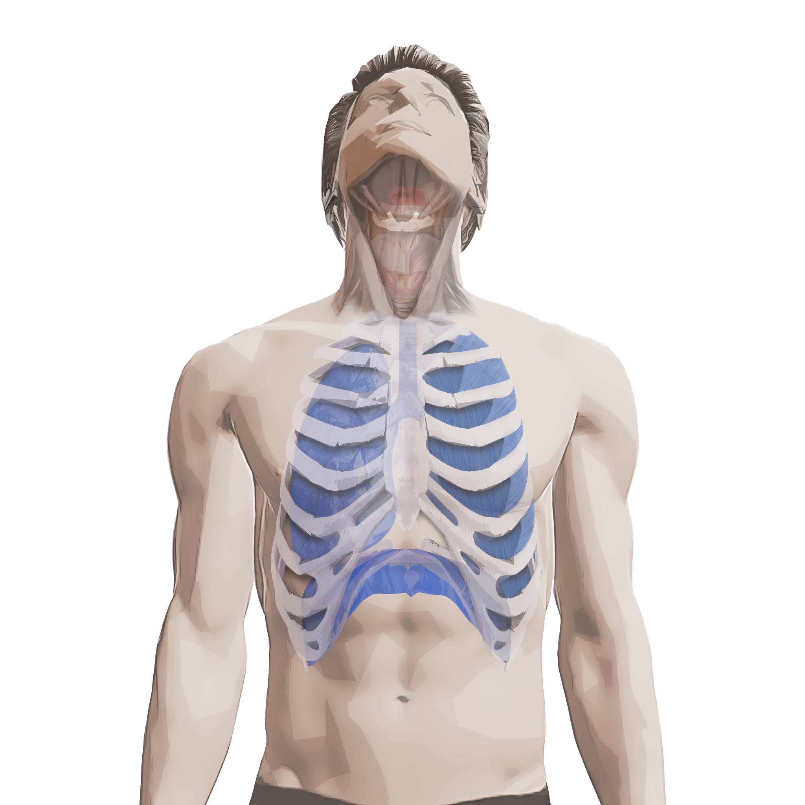
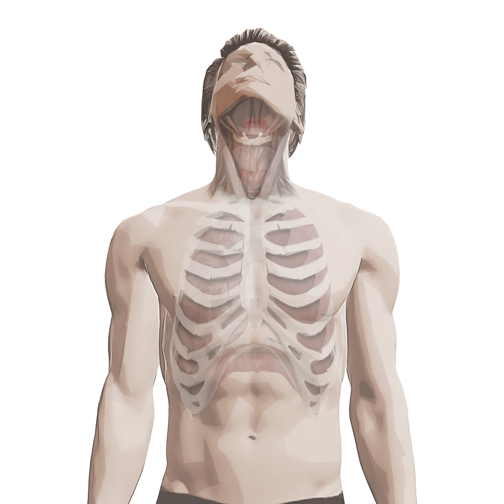

# 트레이닝 타입 분류
  
## Type I: 호흡 의존형 (Breath-Dependent Type)
  
  

  
호흡 의존형 발성은 호흡(에너지원)의 압력 조절이 과도하게 이루어지면서,  
**1차 밸브(내후두근을 포함한 성대)** 와 **2차 밸브(성도)** 의 조절 능력이 부족하여 나타나는 발성 패턴입니다.  
  
발성을 위해서는 폐에서 올라오는 "호흡(에너지원)"을  
1차 밸브인 **성대**가 적절한 **내전(adduction)** 과 **스트레칭**을 통해 정교하게 진동시키고,  
2차 밸브인 **성도**에서 **압력과 공명**을 조절하며 균형을 이루어야 합니다.  
  
그러나 호흡 의존형의 경우  
성대가 충분히 닫히지 않고 적절히 늘어나지 못하여,  
성대가 제 기능을 하지 못하는 만큼 폐에서 나오는 공기 압력으로 보상하려 합니다.  

이로 인해 **호흡 압력이 과도하게 상승**하면서  
발성은 전체적으로 **날카롭고 거칠어지며**,  
힘이 과하게 들어가 **마치 소리를 지르듯이** 강한 느낌이 나타납니다.  

또한, **성대 접촉이 불안정하고 내전이 부족**하기 때문에  
**음정이 흔들리거나 소리가 중간에 갑자기 뒤집히는 음이탈**이 쉽게 발생합니다.

### 주요 문제 요소
#### 성대 내전 부족 (1차 밸브 조절 미흡)
성대 접촉이 약하고 불안정하여  
진동이 일정하지 못하고 음정이 흔들립니다.
#### 성대 스트레칭 조절 미흡 (1차 밸브 조절 부족)
음정을 높일 때 성대를 효과적으로 늘리지 못해  
호흡 압력으로만 음정을 올리려는 습관이 형성됩니다.
#### 호흡 과다 사용 (에너지원 불균형)
성대의 불안정성을 호흡 압력으로 보상하려는 습관으로 인해  
과도한 힘이 들어가고  
소리의 거친 느낌과 발성의 피로도가 증가합니다.
#### 성도 활용 부족 (2차 밸브 활용 부족)
과도한 호흡 압력으로 인해  
성도의 공명 조절이 적절히 이루어지지 않으며,  
음색의 균형과 발성 효율이 떨어집니다.
  
---
  
## Type II: 내후두근 의존형 (Intrinsic Muscle-Dependent Type)  
  
  

  
내후두근 의존형 발성은 호흡을 통해 생성된 에너지가 **1차 밸브(내후두근을 포함한 성대)** 에서  
과도하게 저항하고 억제되는 형태의 발성 패턴입니다.  
이 유형에서는 성대가 지나치게 강한 힘으로 **”내전(adduction)”** 되어  
공기의 흐름이 과도하게 억제되며, 결과적으로 소리는 **무겁고 압박된(pressed)** 음색으로 나타나게 됩니다.  
  
### 주요 문제 요소
#### 성대의 과도한 내전 (1차 밸브 문제)  
 내후두근을 포함한 성대가 과하게 닫혀 있어  
 공기 흐름을 과도하게 제한하고,  
 소리에 불필요한 압박이 발생합니다.  
#### 호흡 흐름의 제한 (에너지원 문제)  
 과내전 상태로 인해 공기의 흐름이 제한되어  
 자연스럽고 효율적인 호흡 사용이 어렵습니다.  
#### 성도의 조절 미흡 (2차 밸브 문제)  
 성도의 조절이 원활하지 않아 발성의 유연성이 떨어지고,   
 음역 변화나 다이내믹 조절이 어렵습니다.  
  
---
  
## Type III: 외후두근 의존형 (Extrinsic Muscle-Dependent Type)  
  
  

  
외후두근 의존형 발성은 음정을 올릴 때, 성대 자체(내후두근을 포함한 성대)의 조절보다는   
**“외후두근(후두를 끌어 올리는 외부 근육)”** 을 과도하게 사용하는 발성 패턴입니다.   
이로 인해 후두가 지나치게 상승하고 성도(성대 위쪽 공간)가 좁아져, 소리가 조이는 음색으로 나타납니다.  
또한, 성대 내전이나 스트레칭과 같은 내적 기능이 충분하지 않기 때문에,   
발성 시 **주변 근육(목 외부근들, 혀, 턱 등)** 의 긴장이 증가하여 자유롭고 편안한 발성이 어렵게 됩니다.  
외후두근 의존형 발성은 다음과 같은 두 가지 원인으로 크게 구분할 수 있습니다.  
  
### 호흡 기능 부족으로 인한 보상 전략으로서의 외후두근 활용  
호흡의 압력이 충분히 만들어지지 않으면, 부족한 에너지를 보완하기 위해   
후두를 들어 올리는 외후두근이 개입하여 음정을 높이는 습관이 형성됩니다.   
이 경우 성대 내전 및 스트레칭을 통한 음정 조절 능력이 약화되어,   
결국 음정의 상승을 외후두근에 전적으로 의존하는 발성 방식으로 고착될 수 있습니다.  
  
### Type I (호흡 의존형)의 과도한 호흡 압력에서 벗어나려다 발생하는 외후두근 보상  
Type I(호흡 의존형)에서 나타나는 강하게 밀어내고 소리치는 발성에서 벗어나기 위해,   
의식적으로 호흡 압력을 줄이면서 외후두근을 활용하여 음정을 높이는 패턴이 형성될 수 있습니다.   
이 경우 발성자는 “소리를 세게 내고 싶지 않다”는 의도로 후두를 들어 올려 음정을 조절하려고 하게 되며,   
결국 의도와 달리 후두가 상승하고 성도 공간이 좁아져 소리가 답답하고 조이는 특성을 가지게 됩니다.  
음정이 상승할 때 **후두의 위치가 필요 이상으로 높아지며**,   
목 주변의 **외후두근이 과도하게 긴장**합니다.  
이로 인해 성도의 공간이 축소되면서 소리가 압박되고 좁아져 **자연스러운 울림이 제한되고 답답한 음색**이 나타납니다.  
이러한 유형은 내후두근을 포함한 성대의 내전이나 스트레칭 능력이 부족할 때,   
후두의 위치를 높이는 방식으로 음정을 조절하려는 보상 패턴으로 발생합니다.   
즉, **1차 밸브(성대)의 조절 부재**로 인해 **2차 밸브(성도)를 잘못된 방식으로 보상하는 특징**을 가지고 있습니다.  
  
### 주요 문제 요소  
### 호흡 압력 부족 또는 불균형 (에너지원 문제)  
충분한 호흡 압력이 형성되지 못하거나,   
호흡과 성대 내전 간의 불균형이 발생하여 외후두근의 과도한 개입을 유도합니다.  
#### 내후두근을 포함한 성대 조절 미흡 (1차 밸브 문제)  
 내후두근의 조절 능력이 부족하여 성대 자체에서 음정을 올리거나   
 공기 흐름을 효율적으로 조절하지 못합니다.  
#### 외후두근의 과도한 개입 (후두 위치 문제)     
 음정 상승 시, 부족한 성대 조절을 보상하기 위해   
 외후두근을 과도하게 사용하여 후두를 들어 올리게 됩니다.  
#### 성도 공간 축소 (2차 밸브 문제)  
 후두가 과도하게 상승하면서 성도 공간이 좁아지고,   
 그로 인해 자연스러운 울림이 감소합니다.  
  
**Type III (외후두근 의존형)** 은 크게 두 가지 경우로 나타날 수 있습니다.  
첫 번째는 호흡 압력이 부족하여 음정을 올리기 위한 보상 전략으로 후두를 들어 올리는 경우이며,  
두 번째는 기존에 호흡을 충분히 사용하여 발성하던 사람이  
**Type I (호흡 의존형) 의 강한 호흡 압력을 줄이려는 과정**에서, 무의식적으로 후두를 높이는 습관이 형성된 경우입니다.  
따라서 트레이닝의 방향도 원인에 따라 다르게 접근해야 합니다.   
호흡 조절 능력을 강화하는 것이 우선인지, 아니면 과도하게 상승하는 후두의 위치를 안정적으로 낮추는 것이 우선인지,  
학습자의 상태에 따라 정확하게 구분하여 진행하는 것이 효과적입니다.  
  
---
  
## Type IV: 과소 기능형 (Hypofunctional Type)  

    
  

  
과소 기능형 발성은 **성대 내전(1차 밸브)과 호흡(에너지원),  
그리고 성도(2차 밸브)의 기능이 전반적으로 약화된 상태**를 의미합니다.  
이 상태에서는 “내후두근을 포함한 성대(1차 밸브)”의 닫힘(adduction)이 약하거나 불완전하여  
적절한 공기 저항을 형성하지 못하고, 에너지원인 호흡의 압력 또한 효율적으로 조절되지 않기 때문에  
공기 흐름이 지나치게 많아지고, 그 결과 발성의 밀도가 떨어지게 됩니다.  
이렇게 성대 닫힘이 약하고 호흡의 압력도 충분히 유지되지 못하면,   
자연스럽게 소리는 **약하고 공기 섞인(breathy) 음색**으로 나타나며, 발성 시 쉽게 지치고 피로감을 느끼게 됩니다.  
이러한 약한 기능을 보상하기 위해 **내후두근을 과도하게 사용하거나**,   
**외후두근의 긴장이 추가되는** 등 **다른 유형의 보상 패턴이 혼합**되어 나타날 수 있습니다.  
  
  
### 주요 문제 요소  
  
#### 호흡 기능 부족 (Energy Source 부족)  
 호흡 압력이 약하고 효율적이지 않아,   
 성대 내전과의 균형을 형성하지 못하고   
 공기 흐름을 통제할 수 없습니다.  
   
#### 내후두근을 포함한 성대의 내전 능력 저하 (1차 밸브 기능 부재)  
 성대가 충분히 닫히지 않기 때문에,   
 지나치게 많은 공기가 빠져나가며   
 밀도 있는 소리를 만들어낼 수 없습니다.  
   
#### 성도의 조절 능력 약화 (2차 밸브 기능 부재)   
 성도가 충분히 활용되지 않아   
 울림과 압력의 조절이 어렵고,   
 성대 기능에도 긍정적인 영향을 미치지 못합니다.  
   
## 보상적 혼합 패턴의 가능성  
  
Type IV(과소 기능형)는 **과소 기능형은 단순히 기능이 약한 상태로만 나타나는 것이 아니라,   
기능의 부재를 보상하려는 노력으로 인해 다른 발성 유형의 패턴이 혼합**되어 나타날 가능성이 높습니다.  
예를 들어, **호흡 압력이 부족한 상태를 보상하기 위해 내후두근을 과도하게 사용하여   
무거워지는 내후두근 의존형이 추가**로 나타날 수도 있고,   
반대로 **외후두근을 활용하여 음정을 높이는 외후두근 의존형의 특성**을 보일 수도 있습니다.  
이러한 보상 전략이 고착될 경우 원래의 문제를 진단하기가 어려워지고,   
단순히 '성대를 더 닫는 훈련'만으로는 오히려 추가적인 문제를 야기할 수 있습니다.   
따라서 보상적인 혼합 패턴까지 함께 고려하여 접근해야 합니다.  
  
---
  
  ## Type V: 균형형 (Balanced Type)  
  
  

  
균형형은 **호흡(에너지 공급), 성대 내전(1차 밸브), 성도 조절(2차 밸브)**,   
그리고 **후두 위치의 안정성이 적절히 조화를 이루는 이상적인 발성 상태**입니다.  
그러나 이 상태가 **항상 완벽히 유지되지는 않고**, 특정 상황에서 조절의 **미세한 불균형**이 생길 수 있습니다.  

예를 들어,  
• **저음과 고음은 연결되지만** 고음에서 **소리가 약해지거나**  
• **소리는 편안하지만**, 특정 음역대나 발음에서 **갑자기 지르거나 조이는 습관**이 나타나는 경우  
• 또는 **곡 전체는 무난히 부르지만, 반복적으로 특정 부분에서만 안정감을 잃는 경우**등이 이에 해당합니다.  
  
이러한 경우, **전체적인 발성 기능은 균형 잡혀 있으나**,  
**일부 조건**(예: 빠른 템포, 어둡거나 밝은 발음, 자음, 높은 음역, 감정, 셈여림 등)에서  
**성대의 내전이 약해지거나, 성도 조절이 덜 효과적으로 작용하는 미세한 편차**가 발생할 수 있습니다.  
  
즉, 이 유형은 **기능이 부족한 상태는 아니며,  
세부 조절의 미세한 부조화**가 문제일 수 있습니다.  
